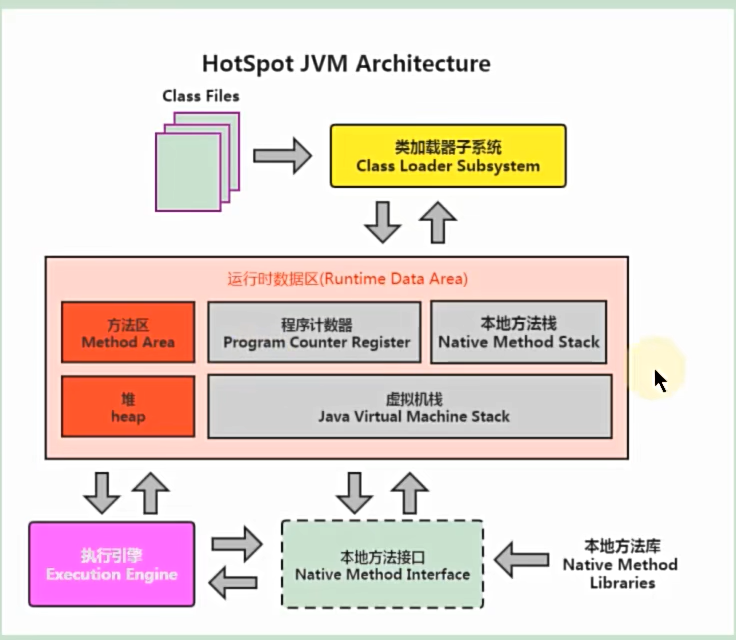

# Hotspot虚拟机的架构
  
  可以分为三层结构看
  - 最上层是javac编译器将编译好的字节码文件class文件,通过java类加载器加载,把对象或class文件存到在jvm划分的内存区域中
  - 中间层是运行时数据区,即方法区、堆、虚拟机栈、本地方法栈、程序计数器几个部分
  - 最下层是执行引擎,像解释器、即时编辑器(JIT:将热点代码编译为本地机器码,以提高执行效率),还有负责管理堆内存的垃圾回收器;
  在执行字节码文件时,会先识别热点代码块,一旦识别出热点代码,JIT编译器会将这些热点代码直接编译成本地机器码,这样可以显著提高
  这部分代码的执行效率;如果并非热点代码,则通过解释器逐行解释字节码为对应的低级操作或系统调用,最终由操作系统的内核执行,并将
  其转换为真正的机器码指令,由处理器执行;