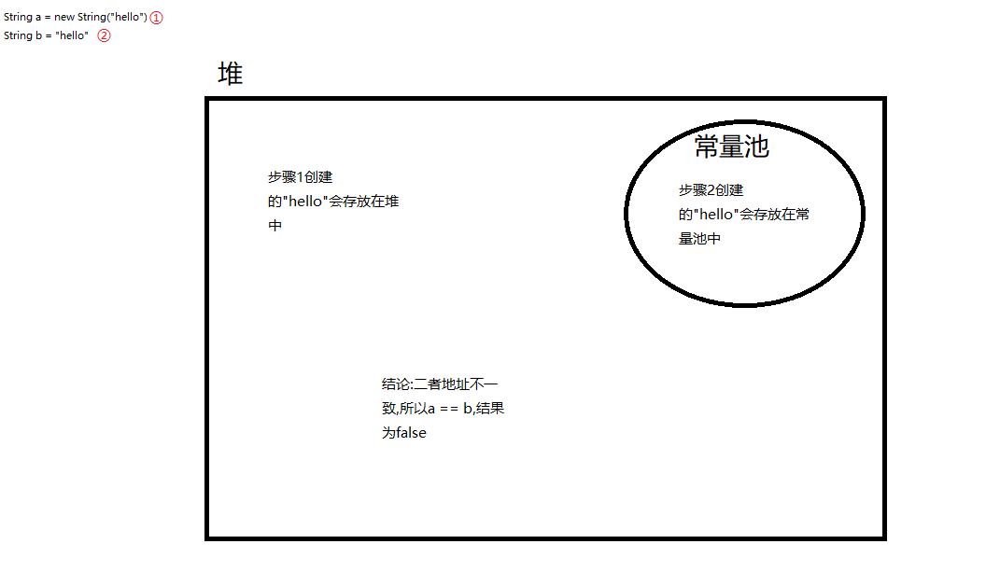
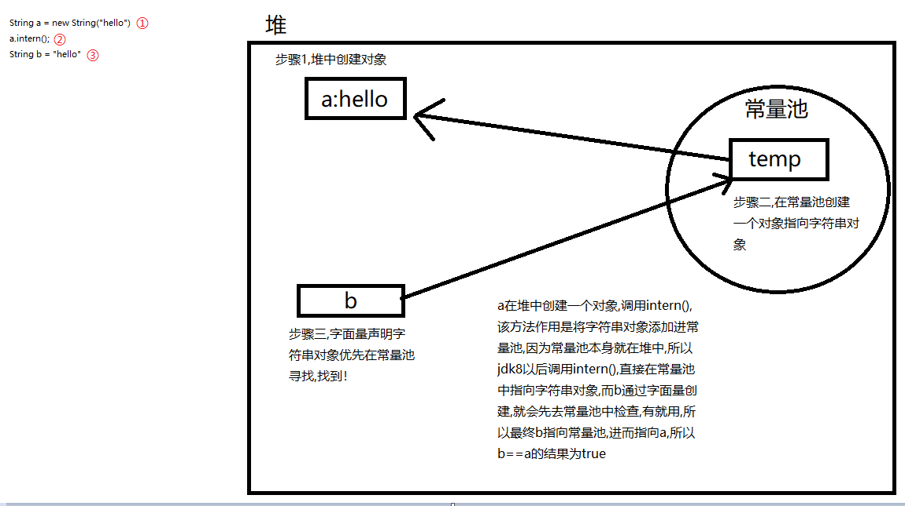
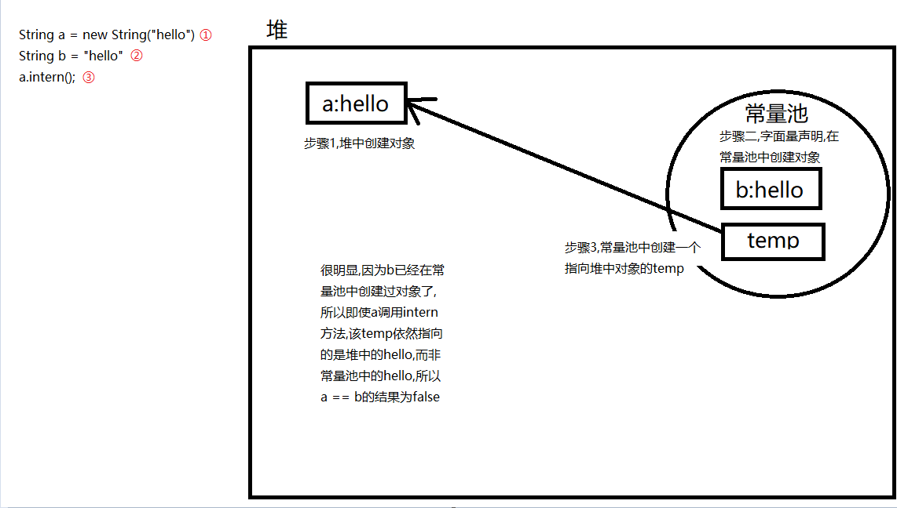

# 一些需要引用字节码来解释的计算现象
  - String str1 = new String("hello") + new String("world");  String str2 = "helloworld";
    str1 == str2, 结果为false
  因为在字节码层面,str1因为涉及字符串的修改,所以是先转为stringbuilder,再通过调用append()+toString()两个方法最终转为string对象的,而str2直接通过String的init方法就完成了初始化,
所以二者是不相等的;
  从Java层面,str1通过new String()的声明方式创建对象,则创建出的字符串对象并不会加入到字符串常量池中,而是会在堆中;而str2因为是通过字面量形式创建则会加入常量池中;
若希望str1==str2,可以通过str1.intern()方法,该方法可以实现将字符串对象添加到常量池中,即在常量池中创建一个对象,该对象指向str1的字符串对象,但是需要注意,如果要创
建的字符串对象在常量池中已存在,那么依然会创建,但是这两个相同的字符串使用"=="进行比较的结果是false,因为一个指向的是实际在堆中的字符串对象,一个指向的是实际在常量池
中的字符串对象;
  
  图解:

- 执行子类构造方法之前要先执行父类构造方法,所以第一个被调用的方法是
  public Father() {
    this.print();
    x = 20;
  }
但还没完,在父类构造方法中调用print()是通过this调用的,this又是什么？没错是当前对象,也就是son对象,所以这里的this.print()调用的是子类的print(),又因为此时
子类还未初始化,所以第一个输出的结果是 : Son.x = 0

- 接下来,就会执行子类的构造方法,输出结果是: Son.x = 30,这个比较简单
- 而最后f.x输出的起始是father的x,因为在java中字段(即类中声明的变量)不具有多态性,这里f是一个Father类型的引用变量,即使它指向的是son类的一个实例,它仍然是Father
类型的引用,因此当你用f.x访问时,它实际上访问的是Father中的x;